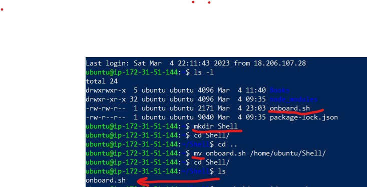

## AUX PROJECT 1: SHELL SCRIPTING   

This project is basically to demostartate how to automate some work using Shell Scripts.        

I am onboarding 10 new Linux users onto a server while using a shell script that reads a csv file that contains the first name of the users to be onboarded.        

I used my vscode to creat the initial script called **onboard.sh*   
       

This was moved to my /Downloads folder in my local machine where I also have my pem key saved for connection to the aws clous server    

copied the script from my local machine into my cloud machine and then connected to my cloud server to confirm it was successful    
        

Created the project folder called Shell 
mkdir Shell 

Then cd into Shell to confirm it was the script was successfully moved into Shell      
  

Created all the required files into Shell including the public and private key pair for connections    
        

The script was tested and the new users were created successfully   

List of new users       
           

New users Connected successfully    
   

## This was a successful Shell scripting excercise!

